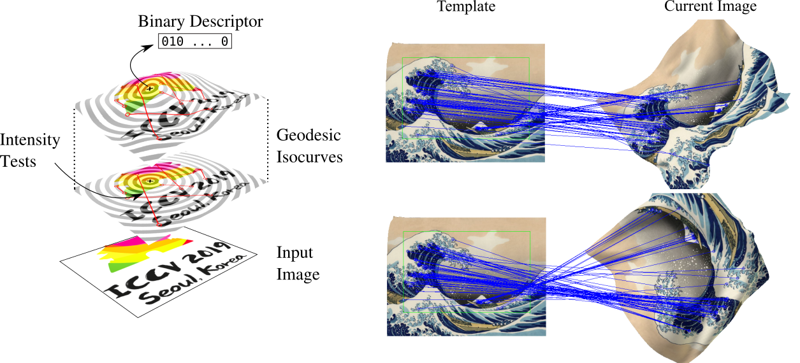
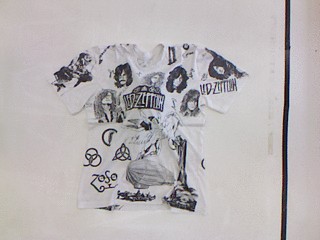
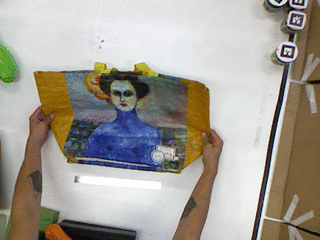
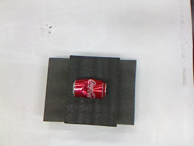
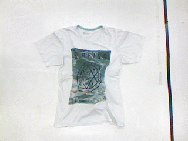
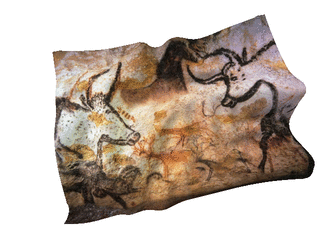
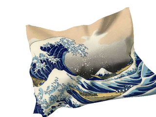
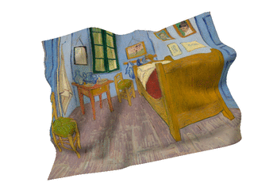

[](LICENSE)

## <b>GEOBIT: Geodesic Binary Descriptor for Nonrigid RGB-D Images</b> <br>[[Project Page]](https://www.verlab.dcc.ufmg.br/descriptors/iccv2019/) [[Paper]](http://openaccess.thecvf.com/content_ICCV_2019/html/Nascimento_GEOBIT_A_Geodesic-Based_Binary_Descriptor_Invariant_to_Non-Rigid_Deformations_for_ICCV_2019_paper.html) [[Container]](https://github.com/verlab/GeobitNonrigidDescriptor_ICCV_2019#i---ready-to-use-container) [[RGB-D Dataset]](https://github.com/verlab/GeobitNonrigidDescriptor_ICCV_2019#rgb-d-dataset)



This repository contains the original implementation of the descriptor presented at "GEOBIT: A Geodesic-Based Binary Descriptor Invariant to Non-Rigid Deformations for RGB-D Images", ICCV 2019. **GeoBit** is a handcrafted binary descriptor that combines appearance and geometric information from RGB-D images to handle isometric non-rigid deformations. It leverages geodesic isocurve information, from heat flow in the surface manifold, to select the feature binary tests. 

If you find this code useful for your research, please cite the paper:

```
@INPROCEEDINGS{nascimento2019iccv,
  author={E. R. {Nascimento} and G. {Potje} and R. {Martins} and F. {Chamone} and M. {Campos} and R. {Bajcsy}},
  booktitle={2019 IEEE/CVF International Conference on Computer Vision (ICCV)}, 
  title={GEOBIT: A Geodesic-Based Binary Descriptor Invariant to Non-Rigid Deformations for RGB-D Images}, 
  year={2019},
  volume={},
  number={},
  pages={10003-10011},
  doi={10.1109/ICCV.2019.01010}}
```

## I - Ready to Use Container

We provide a ready to use container image available at [radac98/geobit-iccv19](https://hub.docker.com/r/radac98/geobit-iccv19). The container is already configured and contains all precompiled binaries and the provided image sample. The following instructions are for using the container in **Singularity** (if you do not have yet **Singularity** installed, please check [INSTALL_SINGULARITY.md](INSTALL_SINGULARITY.md) for detailed instructions). 

Get the container image:
```bash
sudo singularity build --sandbox geobit-iccv19 docker://radac98/geobit-iccv19
```
Then for computing the descriptors from the RGB-D image **"example/cloud_1-rgb.png"** in the keypoints defined  defined at **"cloud_1.csv"**:
```bash
sudo singularity exec geobit-iccv19 /code/GeobitNonrigidDescriptor_ICCV_2019/build/nonrigid_descriptor -inputdir /code/GeobitNonrigidDescriptor_ICCV_2019/example -refcloud cloud_1 -clouds cloud_1 -datasettype real
```

## II - Local Installation Alternative

The install steps were tested on Ubuntu 16.04. Please follow the following steps to install all required libriaries and to compile the descriptor code:

- Install Dependencies
  
    **CMake**

    ```bash
    sudo apt install cmake
    ```

    **OpenCV**
  
    ```bash
    # Install minimal prerequisites (Ubuntu 18.04 as reference)
    sudo apt update && sudo apt install -y cmake g++ wget unzip
    # Download and unpack sources
    wget -O opencv.zip https://github.com/opencv/opencv/archive/master.zip
    wget -O opencv_contrib.zip https://github.com/opencv/opencv_contrib/archive/master.zip
    unzip opencv.zip
    unzip opencv_contrib.zip
    # Create build directory and switch into it
    mkdir -p build && cd build
    # Configure
    cmake -DOPENCV_EXTRA_MODULES_PATH=../opencv_contrib-master/modules ../opencv-master
    # Build
    cmake --build .
    cmake --install .
    ```
    **PCL**
    
    ```bash
    sudo apt install libpcl-dev
    ```
    **Suitsparce**

    ```bash
    sudo apt-get install libsuitesparse-dev
    ```
- Compiling

```bash
mkdir build
cd build
cmake ..
```
- Testing

```bash
./nonrigid_descriptor -inputdir ../example -refcloud cloud_1 -clouds cloud_1 -datasettype real
```

## RGB-D Dataset

<table>
<tr>
<td align="center"></td>
<td align="center"></td>
<td align="center"></td>
</tr>
<tr>
<td align="center"></td>
<td align="center"></td>
<td align="center"></td>
</tr>
<tr>
<td align="center"></td>
<td align="center"></td>
<td align="center"></td>
</tr>
</table>

The dataset is available at [https://www.verlab.dcc.ufmg.br/descriptors/](https://www.verlab.dcc.ufmg.br/descriptors/)

**Dataset of Deformable RGB-D Images (Presented at ICCV’19):**

[Kinect 1 Sequences (38 MB)](https://www.verlab.dcc.ufmg.br/hyperlapse/downloads/nonrigid/Kinect1.tar.gz) : This dataset contains six different real-world objects under different deformation levels and illumination changes. The RGB-D images were acquired at 640 x 480 resolution with a Kinect 1 sensor. Each image has approximately 50 manually annotated keypoints.

[Simulation (26 MB)](https://www.verlab.dcc.ufmg.br/hyperlapse/downloads/nonrigid/SimulationICCV.tar.gz) : This dataset is composed of simulated RGB-D sequences (640 x 480 pixels) with a physics cloth engine simulation. Several textured clothes are subjected to challenging non-rigid deformation, illumination, rotation and scale changes. The keypoints in this sequence are selected with Harris score in the first reference texture image, and their exact correspondence overtime are tracked in the simulation.

**Extended Dataset (Journal Submission under Peer Review):**

[Kinect 2 Sequences (1.1 GB)](https://www.verlab.dcc.ufmg.br/hyperlapse/downloads/nonrigid/Kinect2.tar.gz) : This dataset contains five additional real-world objects acquired with a Kinect 2 sensor at 1920 x 1080 resolution images. We provide image sequences for each of the five objects containing different levels of deformations: light, medium and heavy deformations. Accurate 80 pointwise correspondences are automatically obtained with a motion capture system.

**Dataset File Format**: All datasets follow the same format: Color images are stored as 8-bit PNG and depth images are stored as 16-bit PNG images in millimetres. The intrinsics.xml file contains the intrinsic parameters of the camera, allowing the reconstruction of the pointcloud. Each image also has a respective .csv file, where each line consists of a keypoint number (ID), its 2D image coordinates and a boolean flag indicating if the keypoint is visible in the current keyframe. The keypoints are selected in the reference image, therefore all keypoints are visible in the reference frame.

### License \& Disclaimer
This is research code, expect that it can change and any fitness for a particular purpose is disclaimed.
This software is under GNU General Public License Version 3 ([GPLv3](LICENSE)).

**VeRLab:** Laboratory of Computer Vison and Robotics https://www.verlab.dcc.ufmg.br
<br>


<br/>
